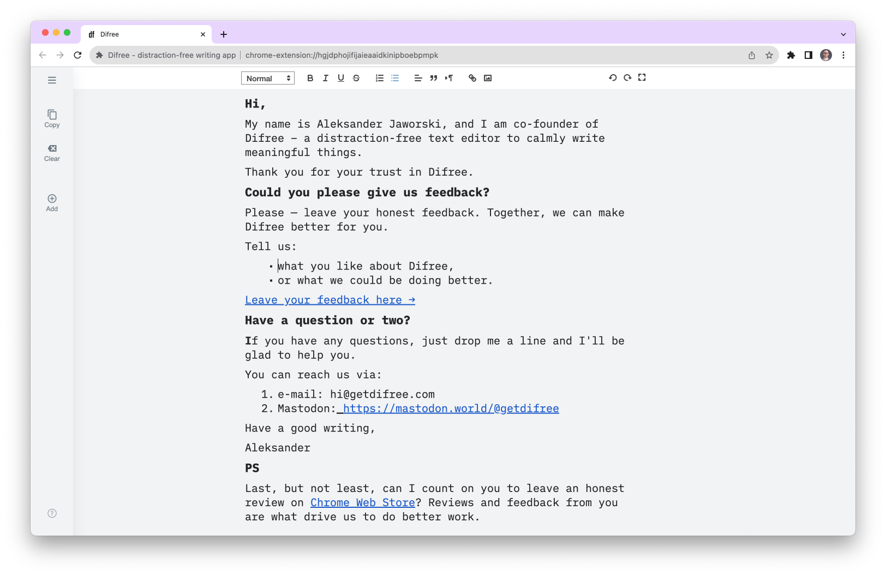
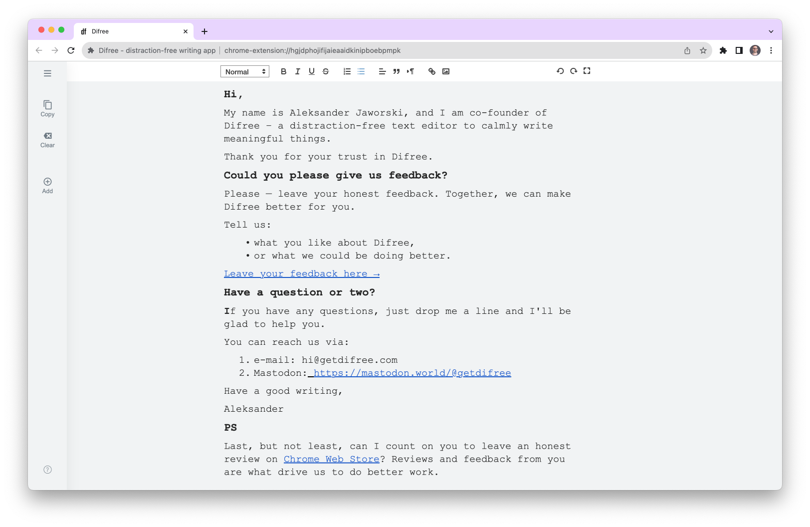

# Hey, Difree Fans!

We're excited to introduce Difree version 0.9.4, packed with new features and improvements to make your writing experience even better: 
1. Writing Right-To-Left (RTL) 
2. and Monospaced Font Selection
<!--truncate-->
## 🚀 What's New in Difree 0.9.4:

### Changelog
    ⭢ 0.9.4 – 2023-09-27
    # Added
    1. Right-to-left writing
    2. Monospaced fonts: iAWriterMono, Courier New
    # Changed
    1. [Bug] Turn off the Key Sound doesn't work

[See all the changes in Changelog](https://www.getdifree.com/changelog/).

### ↔️ Writing Right-To-Left (RTL)

For our users who write in languages that read from right to left, we've got you covered. Difree now supports RTL writing, allowing you to express yourself effortlessly in languages like Arabic, Hebrew, and more. Simply enable RTL mode in the settings and start writing in the direction that feels most natural to you.

### 🔠 Monospaced Font Selection

Precision matters, especially when you're writing code or creating structured documents. With Difree 0.9.4, you can choose from a selection of monospaced fonts 
1. iAWriterMono, 
1. and Courier New

to give your writing a clean and organized look. Customization is key, and now you have more control over your writing environment.

#### iAWriterMono

#### Courier New

### 🐞 Bug Fixes and Minor Improvements

We fixed the issue with turning off the Key Sound.

## 📝 How to Enable Right-to-Left writing:

Getting started with keyboard sounds in Difree is a breeze:

1. Update to Difree 0.9.4 or install it if you haven't already.
2. Go to the Format menu within Difree.
3. Select the RTL icon 

## 📝 How to Enable Monospaced fonts:
1. Update to Difree 0.9.4 or install it if you haven't already.
2. Go to the Settings menu within Difree, by clicking the hamburger menu icon in the top-left corner.
3. Under "Font", you'll find the option to change the font type.

## 🎉 We Want Your Feedback!

Your experience matters to us, and we're eager to hear what you think about this new feature. Do you love it, or do you have suggestions for improvement? Your feedback helps shape the future of Difree, so don't hesitate to share your thoughts with us.

Please let us know how we are doing! Write on [hi@getdifree.com](mailto:hi@getdifree.com) or tooth [@getdifree](https://mastodon.world/@getdifree).

## 📣 Spread the Word!

1. If you're loving Difree 0.9.4 and the fonts, be sure to spread the word. Share this post with your fellow writers and invite them to try Difree.
2. If you find Difree useful, could you please rate us ★★★★★ on [Chrome Web Store](https://i.getdifree.com/review-chrome), or [Firefox Add-ons](https://i.getdifree.com/review-firefox)?

## 📚 Download Difree 0.9.4 Now!

Ready to experience the magic Difree? [Update or install Difree 0.9.4](https://i.getdifree.com/install) today and embark on a writing journey like no other.

Thank you for being a part of our growing community. We can't wait to see how this new feature enhances your writing experience.

## Happy writing!

