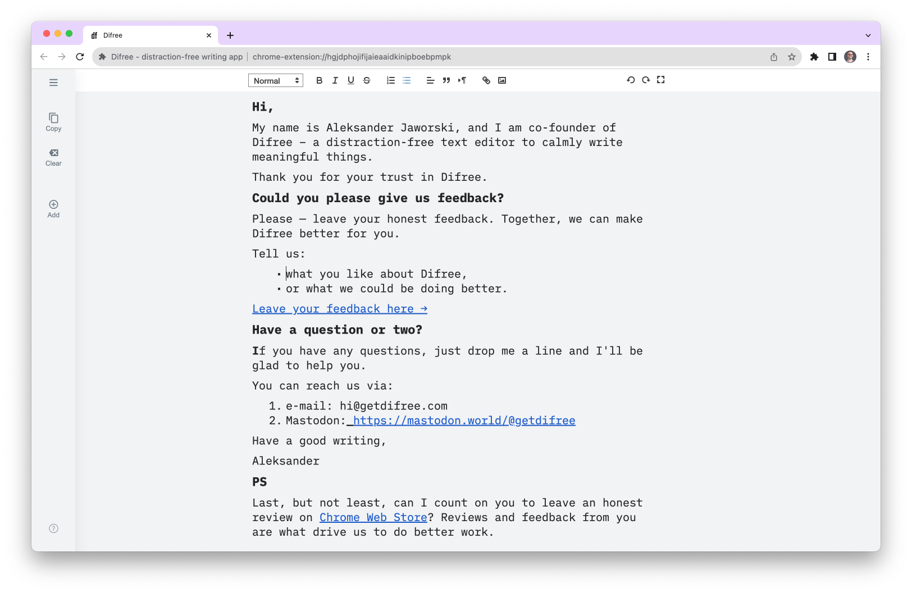
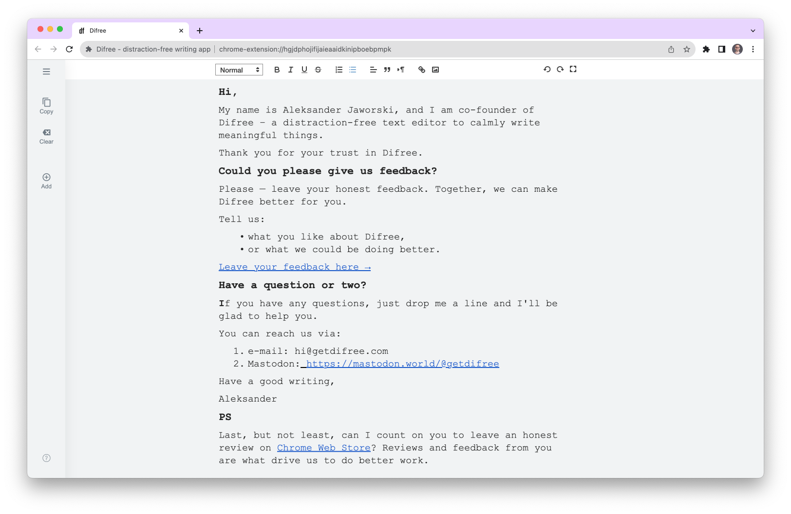

# Hey there, Difree Community!

We've got some exciting news to share that's going to make your writing experience even more enjoyable – we've added in Difree 0.9.4 two awesome monospaced fonts, iAWriterMono and Courier New, to Difree! 🚀

## 🤔 Why Monospaced Fonts?

You might be wondering, "Why monospaced fonts?" Well, there are some great reasons:

**🔪 Precision and Clarity:** Monospaced fonts have a unique characteristic – each character takes up the same horizontal space. This uniformity ensures that every letter, number, and symbol lines up neatly in your writing, whether it's code, a poem, or an essay. This precision can be a game-changer, especially when you're crafting structured documents or working on projects that demand impeccable alignment.

**🧑‍💻 Coding Bliss:** If you're a coder, you're probably well-acquainted with monospaced fonts. They're a coder's best friend because they make code more readable. Each indent, space, and line lines up perfectly, making it easier to spot errors and understand the logic.

**🤩 Inspired by iA Writer:** You may have heard of the writing app [iA Writer](https://ia.net/writer). It's renowned for its minimalist design and distraction-free writing environment. The fonts used in iA Writer contribute to this distraction-free vibe. They create an elegant and professional look on the page that's conducive to focused writing.

**⏳ Courier New's Timeless Appeal:** Speaking of classics, Courier New has been a beloved monospaced font for generations. It's a timeless choice for writers and typists alike due to its legibility and balanced spacing. When you want a font that's trusted and versatile, Courier New is a go-to option.

## 💡 Where did it come from?

Interestingly, some of our fantastic users shared feedback with us, expressing the need for monospaced fonts in Difree. We always value your insights, and this update is a direct result of your suggestions. Thanks for helping us make Difree better!

With these new fonts, we're giving you the power to personalize your writing environment to suit your style and preferences. Whether you're crafting a novel, writing a line of code, or putting together a report, these fonts can elevate your experience and make your work shine.

## 🎬 See It in Action

### 🔎 Preview

We know you're eager to see these fonts in action, and we've got you covered! Check out the screenshots on our [full blog post](https://blog.getdifree.com/2023-09-27/) to get a glimpse of how these fonts can transform your writing space.

#### iAWriterMono

#### Courier New

### 🚀 Install
Ready to give these fonts a spin? Here's how:

1. Open Difree, 
2. Go to Settings, and explore the new font options.

## 📝 Read More

Want to dig deeper into this update? We've got a [full blog post](https://blog.getdifree.com/2023-09-27/) about it.

Thanks for being a part of our community, and stay tuned for more updates to enhance your writing journey!

## 📣 Feedback

We're always listening to your feedback, so let us know what you think! Your insights help us make Difree even better.

Please let us know how we are doing! 
1. Write on [hi@getdifree.com](mailto:hi@getdifree.com), 
2. or tooth [@getdifree](https://mastodon.world/@getdifree),
3. or send [feedback form](https://i.getdifree.com/feedback).

## Happy writing!
