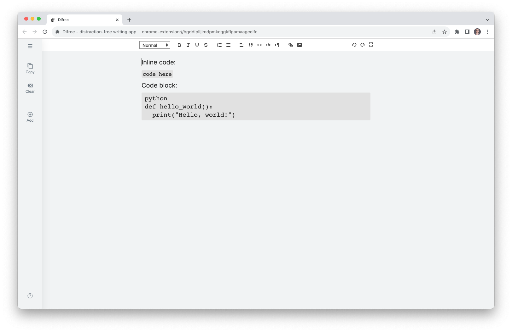
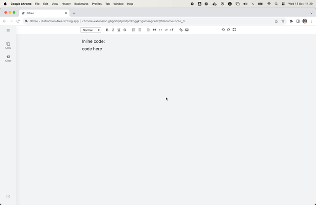
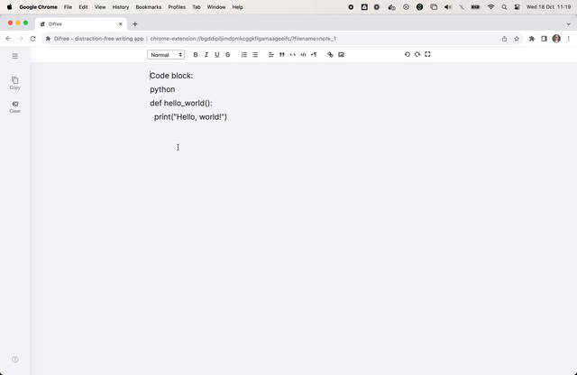
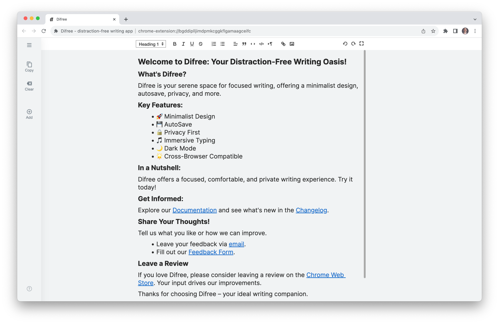
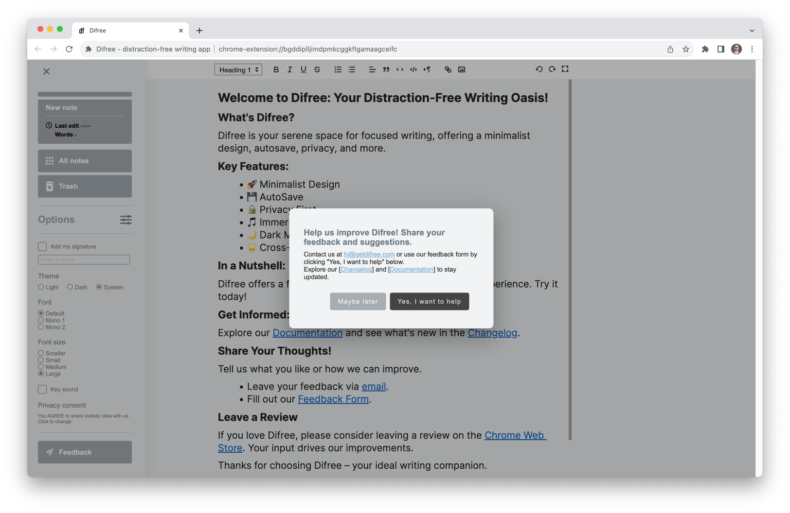

# Difree 0.9.5.7 Release: More Writing Freedom and Enhanced User Insights

Hello, Difree Community!

We're excited to introduce Difree version 0.9.5.7, an update that brings more flexibility to your writing and enhances your experience with insightful user data. Let's explore what's new in this release:
<!--truncate-->

## 🚀 What's New in Difree
### Changelog
    ⭢ 0.9.5.7 – 2023-10-18
    Added
    1. More Formatting Options: Inline code, block code
    2. App Usage Events
    Changed
    1. Adjusted the Welcome Page content
    2. Adjusted the Feedback popup content
[See all the changes in Changelog](https://www.getdifree.com/changelog/).

## More Formatting Options

In this release, we've added new formatting options to give you greater control over your writing. Now, you can easily add inline code and format block code. Whether you're crafting technical documents, sharing code snippets, or simply want to make your writing stand out, these formatting options open up a world of possibilities.

## App Usage Events

Understanding how you use Difree is essential to making your experience even better. We've introduced app usage events to gather insights into how you interact with the app. This data will help us tailor future updates to your preferences and needs, ensuring a writing environment that's perfectly suited to you.

## Welcome Page and Feedback Improvements

We've adjusted the content on the Welcome Page and the Feedback popup to provide you with a smoother onboarding experience and more intuitive feedback submissions. Your input is crucial, and we've made it even easier for you to share your thoughts and suggestions.

## 🎉 Share Your Feedback!

We're eager to witness how this update elevates your writing experience.

As always, we value your insights and suggestions. Your feedback guides the future of Difree, so please don't hesitate to reach out:

1. Connect with us via email at [hi@getdifree.com](mailto:hi@getdifree.com).
2. Use our [feedback form](https://i.getdifree.com/feedback) to submit your thoughts.
3. Join the conversation on Mastodon at [@getdifree](https://mastodon.world/@getdifree).

## 📣 Help Us Spread the Word!

1. If you're enjoying Difree 0.9.5.7 and the latest improvements, be sure to share the news with fellow writers and invite them to explore Difree.
2. Find Difree valuable? Please consider rating us ★★★★★ on the [Chrome Web Store](https://i.getdifree.com/review-chrome) and [Firefox Add-ons](https://i.getdifree.com/review-firefox).

## 📚 Get Difree 0.9.5.7 Today!

Ready to unlock the full potential of Difree? Take the leap and [update or install Difree 0.9.5.7](https://www.getdifree.com/download/) today to embark on a writing journey like no other.

We're grateful to have you as part of our growing community and look forward to witnessing how these enhancements further elevate your writing experience.

## Happy writing, and thank you for being a valued member of our community!

