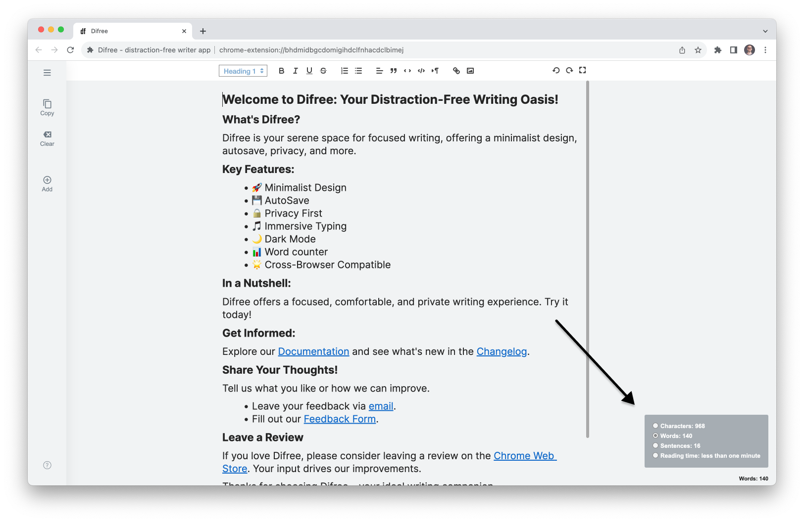

# Release Difree 1.0.1: Counting Your Way to Better Writing

Hello, Difree Enthusiasts!

We are thrilled to introduce Difree version 1.0.1, a milestone in your writing journey with the addition of a valuable feature – the Word Counter. Let's dive into what's new in this release:
<!--truncate-->
## 🚀 What's New in Difree
### Changelog
    ⭢ 1.0.1 – 2023-10-22
    # Added
    1. Add Word counter
    # Changed
    1. Adjust the Welcome Page content
[See all the changes in Changelog](https://www.getdifree.com/changelog/).

## Word Counter: Keep track of your progress and make every word count.
  
The Word Counter is a simple yet powerful tool that allows you to monitor your writing in real time. It's designed to help you stay on track, set goals, and ensure your content is exactly as you want it.

**The Power of Word Counting**

Whether you're working on a blog post, an essay, or a novel, knowing the word count is crucial. It helps you manage your time effectively, maintain a consistent pace, and hit your writing goals. The Word Counter is your writing companion, providing you with the insights you need for a productive writing session.

## 🎉 Share Your Feedback!
As always, we're eager to hear your thoughts and suggestions. Your feedback plays a vital role in shaping the future of Difree, so please don't hesitate to share your insights with us.

1. Connect with us via email at [hi@getdifree.com](mailto:hi@getdifree.com).
2. Use our [feedback form](https://i.getdifree.com/feedback) to submit your thoughts.
3. Join the conversation on Mastodon at [@getdifree](https://mastodon.world/@getdifree).

## 📣 Help Us Spread the Word!
1. If you're loving Difree and the new Word Counter, please spread the word and invite your fellow writers to try it. Your support means the world to us!
1. Please consider rating us ★★★★★ on the [Chrome Web Store](https://i.getdifree.com/review-chrome) and [Firefox Add-ons](https://i.getdifree.com/review-firefox).

## 📚 Get Difree 1.0.1 Today!

Ready to tap into the full capabilities of Difree? Dive right in and [update or install Difree 1.0.1](https://www.getdifree.com/download/) today to set out on a unique writing adventure."

Thank you for being a part of our growing community. We're delighted to have you on this writing journey, and we hope the Word Counter enhances your experience.

## Happy writing, and thank you for being a valued member of our community!

