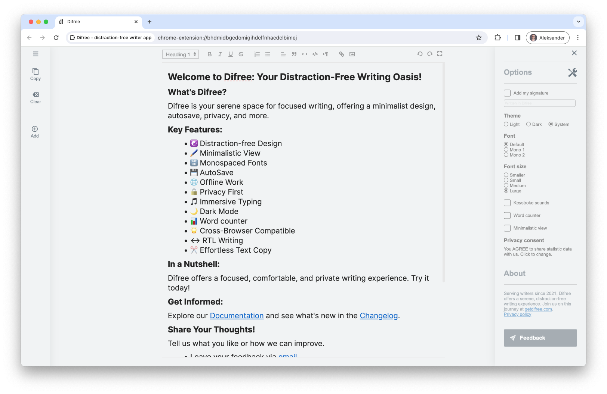

# Release Difree 1.3.0: Refined Settings layout

Greetings, Difree Community!

We're thrilled to unveil Difree 1.3.0, featuring refined Settings layout, an informative About section, and bug fixes for smoother operation.

With Settings now conveniently located in the Sidebar, accessing customization options is more intuitive.

Explore the About section to learn about Difree's mission and the team behind it.

Plus, minor bug fixes ensure a seamless writing journey.

Upgrade now and embark on a refined writing experience with Difree 1.3.0!

<!--truncate-->

## What's New in Difree
### Changelog
    ⭢ 1.3.0 – 2024-02-19
    # Added
    1. Add About section
    # Changed
    1. Settings sections moved to the right Sidebar
    2. [bug] Welcome Page looks bad in dark theme

*[See all the changes in Changelog](https://www.getdifree.com/changelog/).*

## 📣 We Want to Hear from You!

Your feedback fuels our progress. Share with us how these latest bug fixes and telemetric enhancements influence your writing journey. Your insights are instrumental in shaping the evolution of Difree.

Reach out to us through various channels:
1. Email: [hi@getdifree.com](mailto:hi@getdifree.com),
2. [Feedback form](https://i.getdifree.com/feedback),
3. or on Mastodon at [@getdifree](https://mastodon.world/@getdifree).

## 📚 Spread the Word and Support Us!

If you find Difree 1.2.1 beneficial, spread the word among your fellow writers. Your advocacy and support mean the world to us. Consider giving us a ★★★★★ rating on the [Chrome Web Store](https://i.getdifree.com/review-chrome) and [Firefox Add-ons](https://i.getdifree.com/review-firefox) to help others discover Difree's value.

## 📥 Get Your Hands on Difree 1.3.0 Today!

Ready to enjoy a more stable and efficient writing environment? Don't hesitate to update or install Difree 1.3.0, the latest version, today. Your ongoing support is essential to our mission of crafting the ultimate writing sanctuary.

Thank you for being a cherished part of the Difree community! Keep writing, keep creating, and stay inspired!
